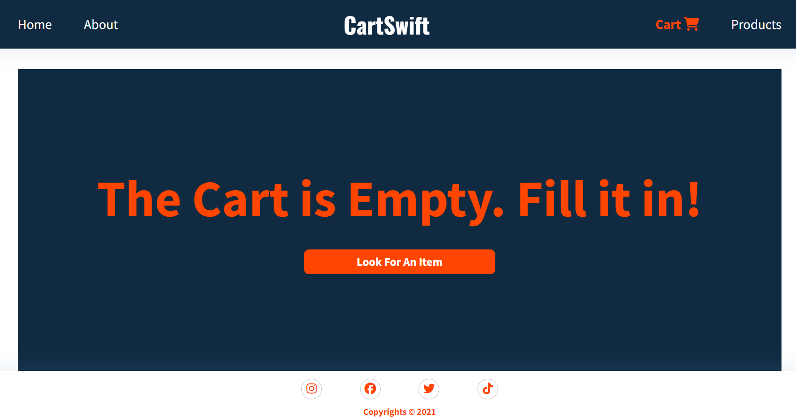

# CartSwift - React.js Cart System

## Table of Contents
- [Introduction](#introduction)
- [Features](#features)
- [Live Demo](#live-demo)
- [Getting Started](#getting-started)
- [Usage](#usage)
- [Project Structure](#project-structure)
- [Screenshots](#screenshots)
- [Contributing](#contributing)
- [License](#license)

## Introduction
CartSwift is a dynamic cart system built using React.js and local storage. It enables users to browse products, add items to the cart, remove items from the cart, view all products, and search for specific products. The application leverages local storage to ensure that the cart data persists across browser sessions, providing a seamless shopping experience.

## Features
- **Add to Cart:** Easily add products to your shopping cart with a single click.
- **Remove from Cart:** Effortlessly remove items from the cart.
- **View Cart:** Display all items currently in the cart with real-time updates.
- **Product Search:** Quickly find specific products using the search functionality.
- **Local Storage:** Ensures cart data is stored persistently, even after the browser is closed or refreshed.

## Live Demo
Check out the live demo of CartSwift [here](https://shopping-cart-rosy-six.vercel.app/).

## Getting Started

### Prerequisites
- Node.js (version 12.x or higher)
- npm (version 6.x or higher)

### Installation

1. Clone the repository:
   ```bash
   git clone https://github.com/tusharkumar07/shopping_cart.git

## Screenshots

### Main Interface


### Products Detail


### Add to Cart Section


### Cart without any Item


### Cart with Items

